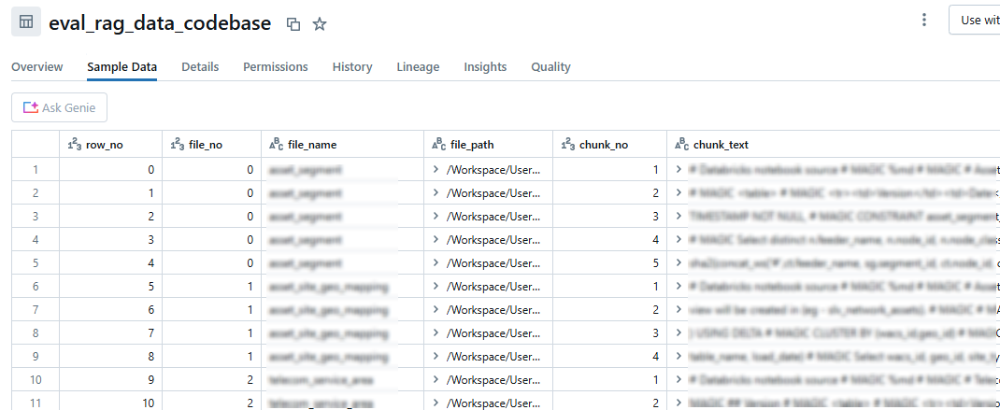

# Databricks RAG (Retrieval Augmented Generation ) LLM with Vector Index

## What is it ??
This is a codebase highlights the end-to-end development of raw text to RAG LLM model offred to business users, leveraging the featuers offered by Databricks services.

In this codebase we leverage the following featuers of databricks supporing the development:

 - Vector Search Index via Endpoint
 - Model development and tracking via MLFlow (Experiments), chain tracking (Debug)
 - Deployment and Serving with feedback processing

 This project draws inferences from the dbdemos provided by databricks. 
 
 [LLM Chatbot With Retrieval Augmented Generation (RAG) and DBRX](https://notebooks.databricks.com/demos/llm-rag-chatbot/index.html#)

## Theory

There many great articles written on the topic and this project is focussed on the technical showcase, more information about RAG LLM can be gained via the following links:

[Databricks: What Is Retrieval Augmented Generation, or RAG?](https://www.databricks.com/glossary/retrieval-augmented-generation-rag#:~:text=Retrieval%20augmented%20generation%2C%20or%20RAG%2C%20is%20an%20architectural%20approach%20that,as%20context%20for%20the%20LLM.)

## Architecture
The key steps involved in the solution provided in this project is as follows:

## Description

In this project, we have extracted the existing notebook code, and provided and an external knowledge to the LLM model, thus helping users to query more tehcnical details of our data engineering processes in-place.

The key highlights of the code base are as follows:

**Prepration of the text data with fixed size chunking**

[Optimizing Chunking Strategies for Retrieval-Augmented Generation (RAG) Applications with Python Implementation](https://jillanisofttech.medium.com/optimizing-chunking-strategies-for-retrieval-augmented-generation-rag-applications-with-python-c3ab5060d3e4)

**Creation of Vector Index upon chunked text data**

[How to create and query a vector search index](https://docs.databricks.com/aws/en/generative-ai/create-query-vector-search#create-a-vector-search-endpoint)

**MLFlow Trace UI - Agent**

The MLflow trace UI in the notebook embedded makes it super easy to track and debug your prompt response and the steps involved in the process, with intermediate results. 

[Agent observability with MLflow Tracing](https://docs.databricks.com/aws/en/mlflow/mlflow-tracing)

**Model Deployment and Serving Endpoint**

[Log and register AI agents](https://docs.databricks.com/aws/en/generative-ai/agent-framework/log-agent#register-agent)

[Deploy an agent for generative AI application](https://docs.databricks.com/aws/en/generative-ai/agent-framework/deploy-agent)

Once the model is deployed and serving endpoint is setup, the custom agent is ready to be evalutated against the user queries via pre-built chat ui, which canbe shared and evaluated.

This setup creates a well managed LLMOps with all the relevant monitoring and the feeback collection and improvement system in place. 